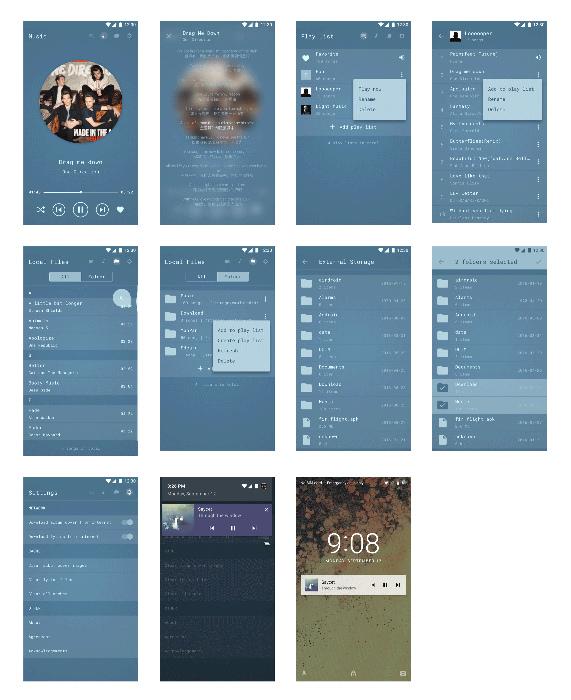

# A Stylish Music Player

## Acknowledgements

Thanks to these projects and libraries:

**Libraries**

- [RxJava](https://github.com/ReactiveX/RxJava)
- [RxAndroid](https://github.com/ReactiveX/RxAndroid)
- [Retrofit](https://github.com/square/retrofit)
- [Butter Knife](https://github.com/JakeWharton/butterknife)
- [Calligraphy](https://github.com/chrisjenx/Calligraphy)
- [LiteOrm](https://github.com/litesuits/android-lite-orm)

**Design**

- [Material icons](https://design.google.com/icons/)

## License

> The MIT License (MIT)

> Copyright (c) 2016 Ryan Hoo
